# **Travel**
## **Site Overview**
Welcome to Travel!

Welcome to a place dedicated to travel and travelling experiences. Use this site to plan your next vacation and store future experiences you wish to have. 

The map function will allow users to pick and view destinations, see local tourist attractions and local places of interest and look at directions to and from various destinations. 

The bucket list tab will allow users to add experiences and things to do to help plan thier next vacation.

The currency converter will provide real time exchange rates for the currency supplied, further allowing users to make decisions on where their next vacation will be. 

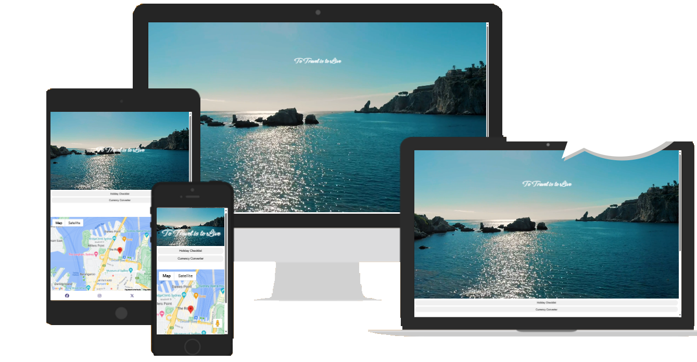

## Table of contents:
1. [**Site Overview**](#site-overview)
1. [**Planning stage**](#planning-stage)
    * [***Target Audiences***](#target-audiences)
    * [***User Stories***](#user-stories)
    * [***Site Aims***](#site-aims)
    * [***How Is This Will Be Achieved:***](#how-this-will-be-achieved)
    * [***Wireframes***](#wireframes)
    * [***Color Scheme***](#color-scheme)
    * [***Technology Used***](#Technology-Used)
    * [***Languages Used***](#Languages-Used)
 1. [**Current Features**](#current-features)
    * [***Main body:***](#main-body)
        * [*Navigation Bar*](#navigation-bar)
        * [*toggle functionality *](#toggle-functionality)
        
    * [**Footer**](#footer)
1. [**Future-Enhancements**](#future-enhancements)
1. [**Testing Phase**](#testing-phase)
    * [*Testing*](#Testing)
        * [*Testing User Stories from User Experience (UX) Section*](#Testing-User-Stories-from-User-Experience-(UX)-Section) 
        * [*Further Testing*](#Further-Testing) 
1. [**Accessibility**](#Accessibility)
1. [**Known Bugs**](#Known-Bugs)
1. [**Deployment**](#deployment)
1. [**Credits**](#credits)
    * [**Honourable mentions**](#honorable-mentions)
     * [**Content**](#content)
    * [**Media**](#media)

## **Planning stage**
### **Target Audiences:**
* Those who are planning a trip locally or abroad. 
* Users who want a way to store their holiday ideas and dreams
* Users who have long term vacation goals

### **User Stories:**
* As a user, I want to look at the world map and see where vacation options could be in.
* As a user, I want to be able to use the map to find places of interests in my chosen vacation destination.
* As a user, I want to use the map to plan travel options and local travel options from a point to a point.
* As a user, I want to store experiences I’d like to have, electronically .
* As a user, I want the ability to make travel decisions influenced by the exchange rate of that destination. 

### **Site Aims:**
* To create a easy to use travel planner.
* To provide a map which is interactive.
* To provide a ‘bucket list’ area where users can list out the travel experiences they want to have.
* To provide the exchange rate of various currencies, in real-time.
* To calendar will enable users to plan their travel dates.

### **How This Will Be Achieved:**
* The map will be available on all pages and will be interactive on all pages.
* Users can then toggle between the bucket list, exchange rate and calendar elements.
* Users will be able to mark the bucket list as completed or ‘in progress’
* An API will be available to provide upto date exchange rates, map and flags aligned to the currency being used.   

### **Wireframes:**
I used Balsamiq to create a visual representation of the Travel site - below are the initial idea designs:

* Desktop Wireframes:
    * 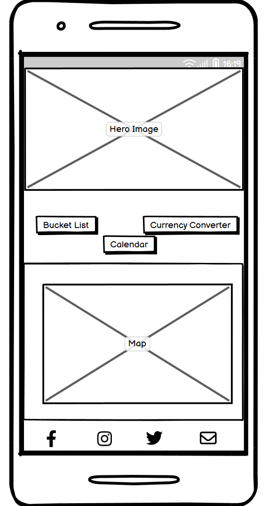
    * 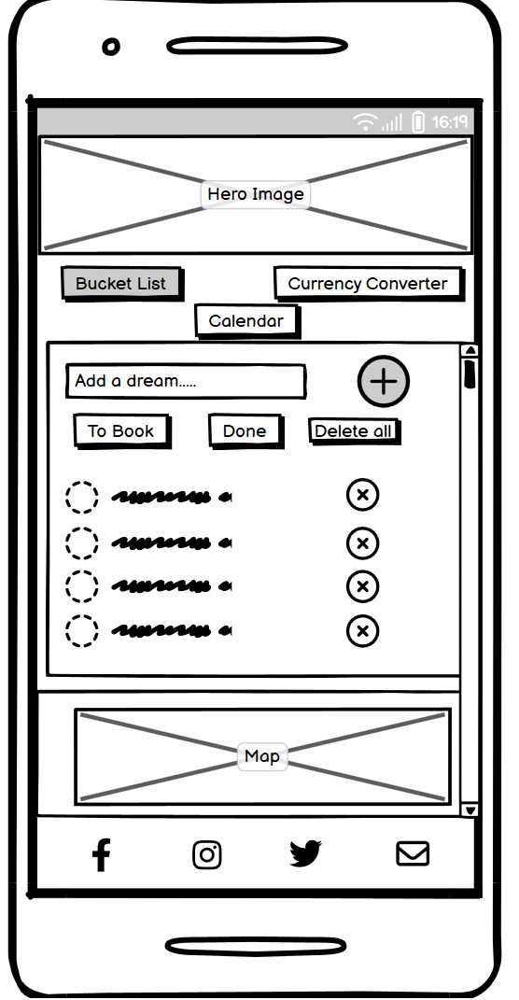
    * 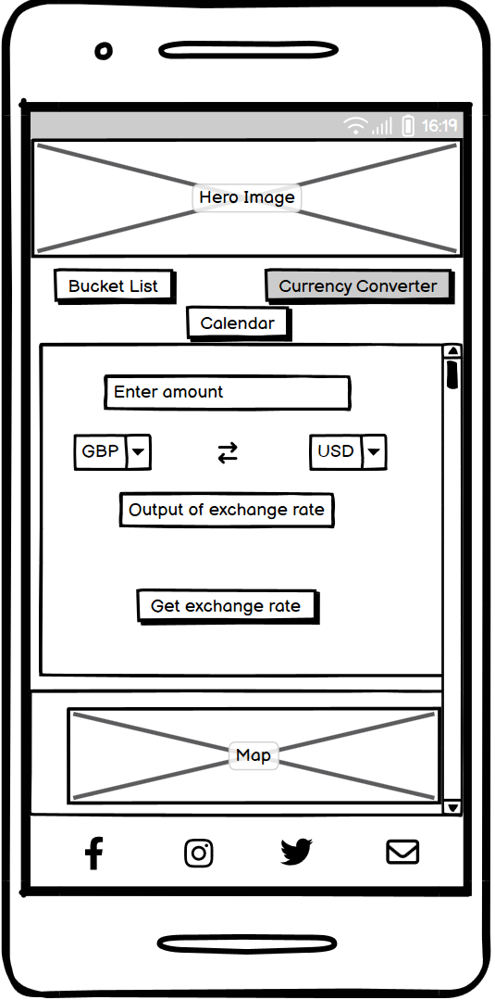
   

I had wanted to add a calendar to the site, but omitted this due to time restraints. 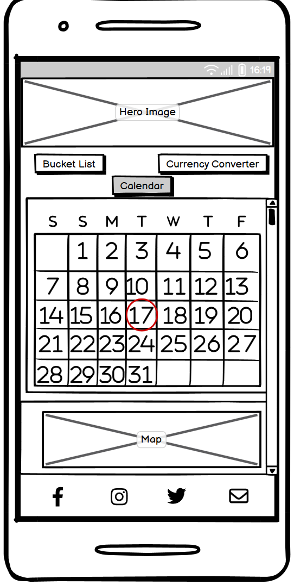

 

### **Color Scheme:**
There is very little colour scheme through this website, I wanted to keep it as clean as possible. I used colour to emphasis aspects and to highlight buttons being used.

The colours selected were keeping in line with the clean minamilist look.

### **Technology Used:**
## Languages Used

-   [HTML5](https://en.wikipedia.org/wiki/HTML5)
-   [CSS3](https://en.wikipedia.org/wiki/Cascading_Style_Sheets)
-   [JavaScript] (JavaScript | MDN (mozilla.org))

### Frameworks, Libraries & Programs Used

1. [Font Awesome:](https://fontawesome.com/)
    - Font Awesome was used on the bucket list, alongside the social media icons within the footer.
1. [Git](https://git-scm.com/)
    - Git was used for version control by utilizing the command line terminal to commit to Git and Push to GitHub.
1. [GitHub:](https://github.com/)
    - GitHub was used to store the project code after being pushed from Git.
1. VIDEO EDITING SOFTWARE
1. [Balsamiq:](https://balsamiq.com/)
    - Balsamiq was used to create the wireframes during the design process.
1. [ImageColorPicker:](https://imagecolorpicker.com/)
    -Image Color Picker was used to select the colors throughout the site. 

## **Current Features **
###  **Main body**
The page will have a toggle function which will display the various elements onto the main page. The map will be at the bottom of the page and will be static as the various elements are displayed on the screen.

### *Navigation Bar:*
A navigation bar was not used as the page is one page.

### *toggle functionality:*
* I wanted the interactivity of the page to be focused on this toggle functionality. Using Javascript, I was able to load dynamic HTML and javascript functionality dependent on what the user selected.
ADD SCREEN SHOT OF FINAL TOGGLE BUTTONS

## **Footer**
* The footer holds icons to access social media sites and an email functionality to contact us.

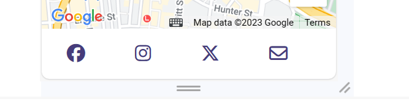

## **Future-Enhancements**

* In the future, this site will have a backend which will enable the user to save their bucket lists.
* I would also like to provide a way of selecting areas on the map which can will then add the country name to their bucket list.
* It would be good if the bucket list can have different tabs, e.g. countries/places to visit, culture to experience, activities to experience.
* With the backend functionality I will be able to include aspects like searchable activities and businesses, a profile area and chat function.
* Further API’s would be used, API’s which offer flight/hotel information or activities to book. 
* The ability for users to chat with others about travel destinations and other’s experiences.
* The ability for users to upload photos, reviews and ratings of places they have been.
* The ability for users to arrange group trips.

### **Testing Phase**

## **Testing**

The W3C Markup Validator and W3C CSS Validator Services were used to validate every page of the project to ensure there were no syntax errors in the project.

-   [W3C Markup Validator](https://validator.w3.org/nu/) 
    
    Initial tests show various errors to be corrected.
    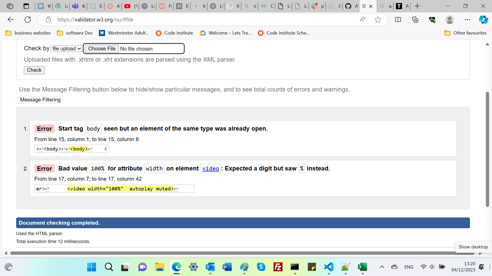
    After fixing the errors, the final test results confirm no errors or warnings.
    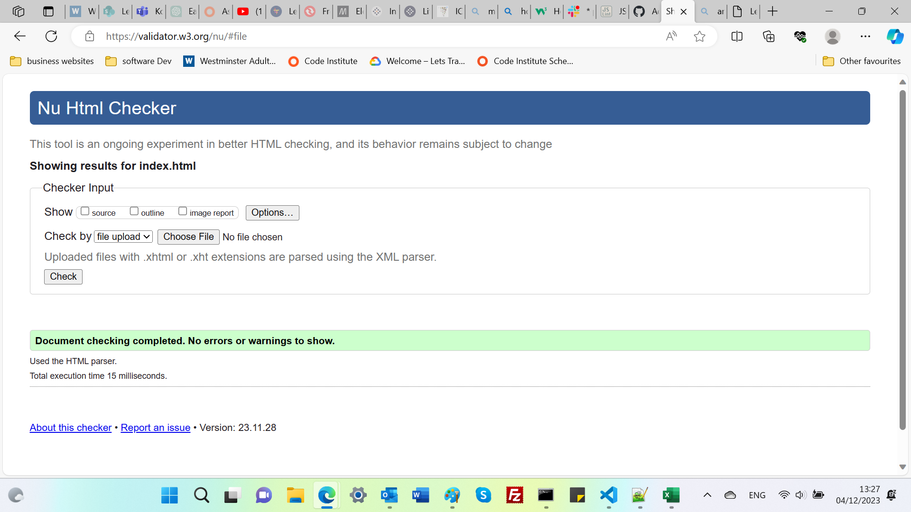

    [W3C CSS Validator](https://jigsaw.w3.org/css-validator) 

    CSS:

    Initial tests show various errors to be corrected.
    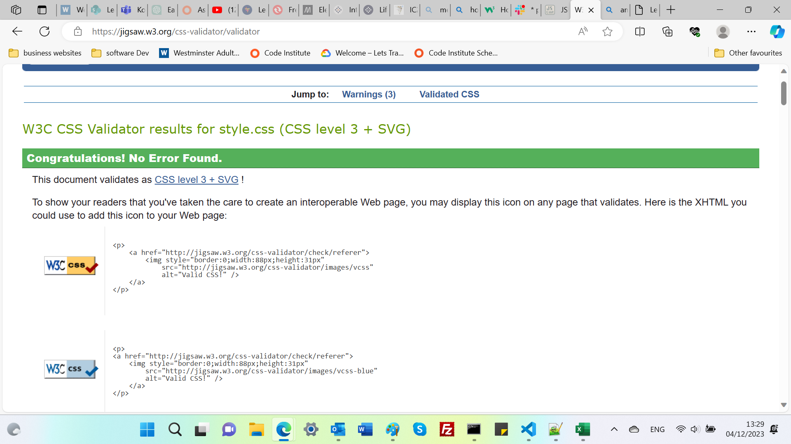
    
JAvascript

There were no erros identified within the console log within the browser 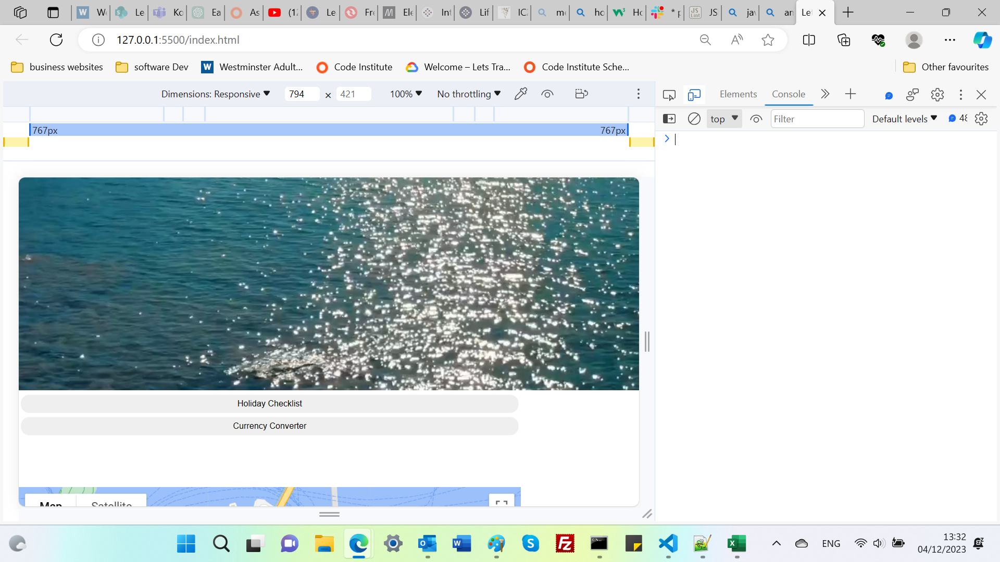

### Testing User Stories from User Experience (UX) Section
1)	As a user, I want to look at the world map and see where vacation options could be in:
a.	The user can move the map around to find places within the world which resonates with them. And understand where this place is in relation to other places or their home.
b.	This could be improved by enabling a search functionality within the map.

2)	As a user, I want to be able to use the map to find places of interests in their chosen vacation destination:
a.	The user can view the map and the map can be interacted with to zoom into locations and see places of interest.

3)	As a user, I want to use the map to plan travel options and local travel options from a point to a point:
a.	The map can provide directions, including distance from one point on the map to another. 
b.	The map can also support the user with finding local transport options.

4)	As a user, I want to store experiences I’d like to have, electronically :
a.	The user can use the bucket list tab to note the experiences they would like to experience in the future. This can include places, experiences, activities, festivities.
b.	This could be improved by using backend functionality which would store the users input so they can return without losing any data.

5)	As a user, I want the ability to make travel decisions influenced by the exchange rate of that destination. 
a.	The exchange rate API can be used to select the current currency and the destination currency and see the real time exchange rates. 

### Further Testing

-   The Website was tested on Google Chrome, Internet Explorer and Microsoft Edge.
-   The website was viewed on a variety of devices such as Desktop, Laptop and android phones.
-   A large amount of testing was done to ensure that all pages were linking correctly.
-   Friends and family members were asked to review the site and documentation to point out any bugs and/or user experience issues.

### Accessibility
I wanted to ensure the site supported all visitors, I included the following in my code to ensure this:

* The site is responsive to different screen sizes 
* I used semantic elements throughout the design

### ***Known Bugs***
*  Users cannot  use the ‘enter’ key when entering text into the input field. When they do, it refreshes the page and returns the user to the main page view.

Ideally the user can choose between clicking the button with the mouse or pressing the enter key to add items to the to-do list. 
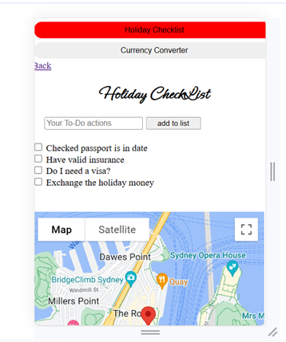

* Also on the above page, there is no option for the user to delete items entered onto the list either by mistake or items which are no longer needed. I think this functionality would have worked if my to-do list was a list item rather than a form element. 

*  There is an overflow which I am unable to remove, which impacts the usability when scaling the page. 
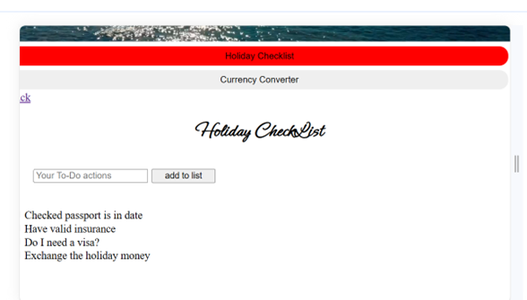
  

## **Deployment**
I deployed the page on GitHub pages via the following procedure: -

1. From the project's [repository](https://github.com/AdelleKing/Travel), go to the **Settings** tab.
2. From the left-hand menu, select the **Pages** tab.
3. Under the **Source** section, select the **Main** branch from the drop-down menu and click **Save**.
4. A message will be displayed to indicate a successful deployment to GitHub pages and provide the live link.

***
## **Credits**
### **Honourable mentions**
I’d like to thank the Code Institute tutors who spent time walking through my idea and how best to create the functionality.
* I used W3schools, youtube and stack overflow for general "how to's" throughout the project alongside course material from Code Institute. 

### **Content:**
* Most of the content was written by myself.
* Icons in the forms were taken from [Font Awesome](https://fontawesome.com) 
* This video supported the Currency Converter element on thie site [CodingNepal
](https://www.youtube.com/watch?v=UY7F37KHyI8)

### **Media:**
* Video used as hero image was taken from [Pexels](https://www.pexels.com/)

